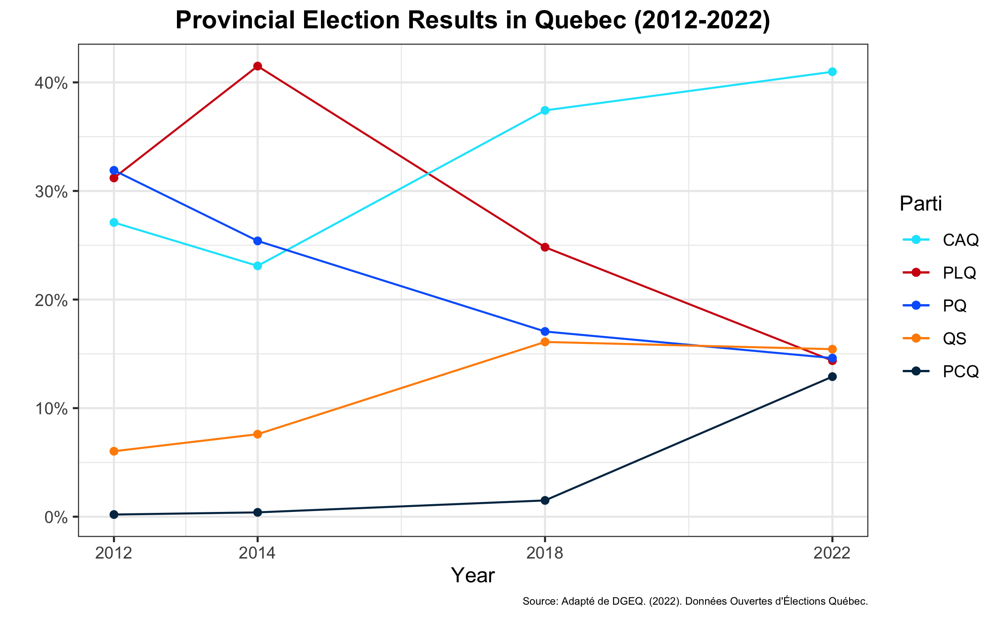
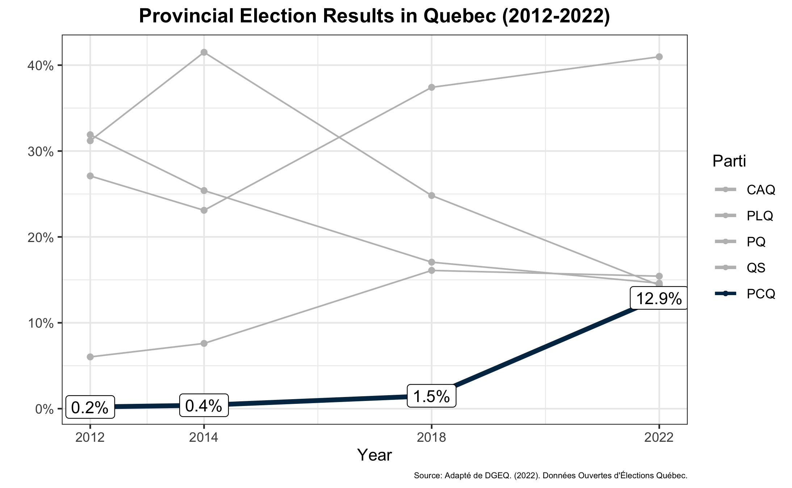
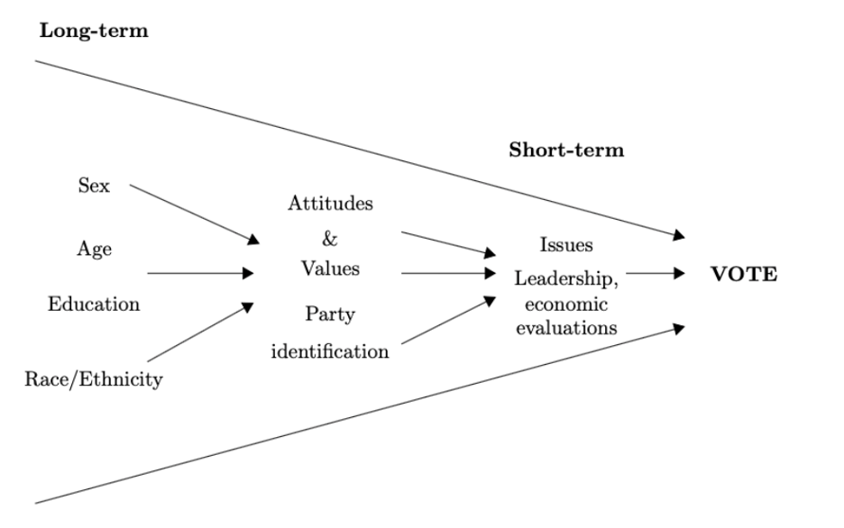
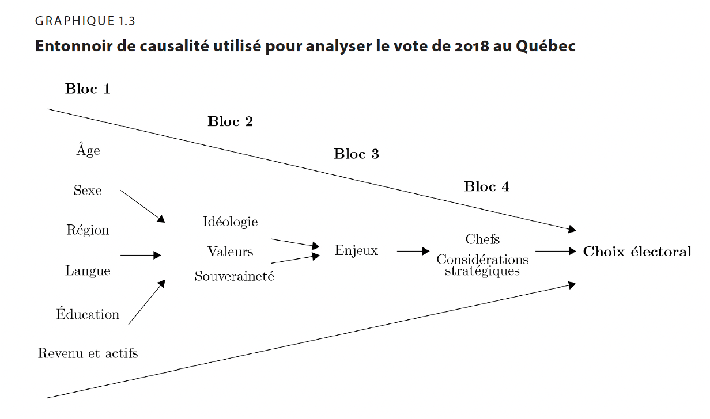
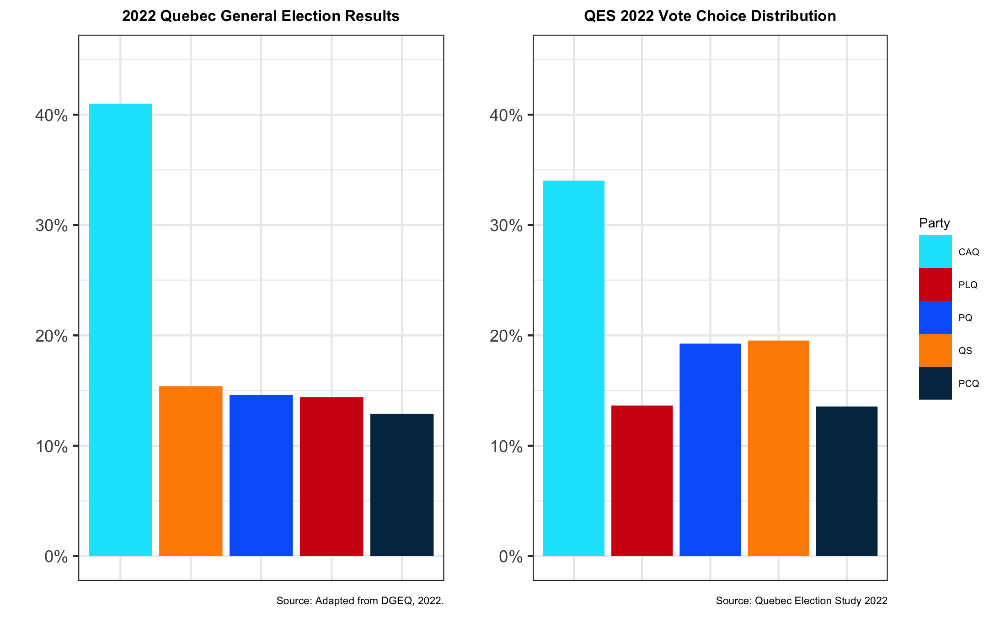

```{r setup, include=TRUE, echo = FALSE}
knitr::opts_chunk$set(echo = FALSE)
knitr::opts_chunk$set(warning = FALSE)
```

```{r xaringan-themer, include=TRUE, warning=FALSE, message=FALSE}
library(xaringanthemer)
library(magrittr)
library(tidyverse)
library(kableExtra)
library(lubridate)
library(modelsummary)

style_mono_accent(
  base_color = "#1c3753",
  header_font_google = google_font("Josefin Sans"),
  text_font_google   = google_font("Montserrat", "300", "300i"),
  code_font_google   = google_font("Fira Mono")
)
```

```{r}
load("QES_2022/QES_cleaned.Rda")
```


## The Question

* Even though the Parti Conservateur du Québec (PCQ) did not succeed in electing any members to the Assemblée Nationale in the October 2022 provincial election in Quebec, the party nonetheless won 12.9% of the popular vote, up from 1.5% in the 2018 election:  

* The party (and its leader, Éric Duhaime) campaigned on topics **associated with the economic right** (with a clear agenda of state reduction) as well as dissatisfaction with the Legault government, particularly its **COVID-19 health measure.**

**Which of the two issue dimensions drove the PCQ's success the most?** 


.pull-left[]
.pull-right[]

---
## Theory and Hypotheses (1)

* The dominant approach in the study of elections has followed the “multistage model", which leverages the metaphor of the “funnel of causality” initially developed by Cambell et al. (1960). 

* In a nutshell, the funnel includes different ‘blocs’ or ‘stages’ of variables that represent the causal relationships between explanatory variables and vote choice. This model has also been used to study political behavior in Quebec (Bélenager et al. 2022):

.pull-left[

* **Source:** Bélanger et al. 2022

]
.pull-right[

* **Source:** Campbell et al. 1960
]


---
## Theory and Hypotheses (2)

* $H_0 =$ Factors associated with the economic right, dissatisfaction with Legault government, and leader evaluation do not explain PCQ vote choice in the 2022 Provincial election.

* $H_1 =$ Factors associated with the economic right explain PCQ vote choice in the 2022 Provincial election.

* $H_2 =$ In the 2022 provincial election, the PCQ vote is explained by factors related to dissatisfaction with the Legault government regarding COVID-19.             

<br>

1. "Market Liberalism" (i.e., Economic Conservatism) $\rightarrow{}$ **BLOC 2**

1. (Dis)Satisfaction with COVID-related health policies by the Legault Government $\rightarrow{}$ **BLOC 3**

---
## Data & Survey Design (1)


* Using individual-level survey data from the 2022 Quebec Election Study, we assess the degree to which these two factors can explain support for the PCQ.

<br>


* Panel data (Pre-election and post-election questionnaires) 
  * Very little **attrition**:


```{r, include = T}
df <- df %>%
  mutate(CPS = ifelse(!is.na(cps_weight_general), "CPS: Responded", NA),
         PES = ifelse(!is.na(pes_weight_general), "PES: Responded", "PES: Did Not Respond"))
```

```{r, include = T}
datasummary_crosstab(CPS ~ PES, statistic = ~ N + Percent() + 1, data = df, title = "Attrition, 2022 Quebec Election Study")
```

---
## Data & Survey Design (2)

* In terms of vote choice, our sample is (sort of) representative:



* Our models include survey weights that account for **demographics** and **voting choices**


---
## Dependent Variable

* Logit/Linear Probability Models (LPMs)

  * Dependent Variable is a **dichotomous** variable, in which **1 = Voted for the PCQ in the 2022 Election.**
  
<br>
 
<br>


```{r, include = T}
N <- function(x) sum(x, na.rm = TRUE)

datasummary(vote_PCQ ~ Mean + SD + N,
            data = df)
```

---
## Independent Variables (1)

.pull-left[**Bloc 1:**

* Age (or Generation)
<br>
* Gender

* Education (3 categories)

* Income (5 quintiles)

* Language

* Holdings ("patrimoine")
]
.pull-right[**Bloc 2:**

* Ideology (self-placement)


* **Market Liberalism index (i.e., Economic Conservatism)**

* Moral Traditionalism index (i.e., "lifestyles")

* Integration Index
* Independence

]


---
## Independent Variables (2)

**Bloc 3:**

* Evaluation of the economy

* **COVID-19 Dissatisfaction Index**

* Anti-Immigration Index

  
* Most Imporant Issue (Closed Choices [Coded Binary])
 .pull-left[
 
* Economy
* Healthcare
* Environment
* Education
* Poverty
* Housing Crisis
* Integrity & Corruption]

  .pull-right[ 

* Taxes
* Sovereignty
* Cost of living
* Immigration
* Quebec City's Third Link
* The French Language
* Gun violence]

<br>
<br>
<br>
<br>
<br>
<br>
<br>
<br>

* **Bloc 4 should not be included in our estimation of the effect of Economic Conservatism/COVID Dissatisfaction, as it is causally prior.**

---
# Results


---
# Next Steps

* Add Bloc 4 (Leader Evaluation & Strategic Considerations) and (maybe) other variables
  * Regions
  * Vaccination Status?
  * Cynism/Populism
  * Authoritarian Values

* Additional Diagnostics
  * Robust Standard Errors
  * Influence plot
  * VIF for multicollinearity

* Factor Analysis (for indexes)

* Multiple Imputation (for planned missingness)
  
* Other Models?
  * Examine the factors that influenced the votes of PCQ voters, PCQ supporters, and those who say PCQ is their second choice.

  
---
# Appendix (1)
## Market Liberalism

*  *The government should leave it entirely to the private sector to create jobs.*
<br>

* *Government should see to it that everyone has a decent standard of living.*


* *How appropriate do you think it is for the Quebec government to spend more than its income in any given year?*


* *How much do you think should be done to reduce the gap between the rich and the poor in Quebec?*


---
# Appendix (2)
## COVID Dissatisfaction

*  *How satisfied are you with the following governments' handling of the COVID-19 pandemic?*
<br>

* *How well has Quebec done in handling the COVID-19 pandemic in comparison to other provinces?*

```{r, include=TRUE}
df_cor <- df %>%
  select(c(covid_1, covid_2, covidDis_index))

datasummary_correlation(df_cor)
```

---
# Appendix (3)
## Moral Traditionalism

*  *How much do you think should be done for lesbians and gay men in Quebec?*
<br>

* *Newer lifestyles are contributing to the breakdown of our society.*

* *This country would have many fewer problems if there was more emphasis on traditional family values.* and *This province would have many fewer problems if there was more emphasis on traditional family values.* (planned missingness design)

* *How much do you think should be done for women in Quebec?*

* *Society would be better off if fewer women worked outside the home.*

---
# Appendix (4)
## Integration (Defining Characteristics of Integration)

*  *To be able to speak French.*
<br>

* *To respect Quebec's political institutions and laws.*


* *To feel Québécois.*

*  *To share Quebeckers’ values.*


---
# Appendix (5)
## Anti-Immigration Index

*  *Immigrants are generally good for Quebec's economy.*
<br>

* *Quebec's culture is generally harmed by immigrants.*


* *Immigrants increase crime rates in Quebec.*

